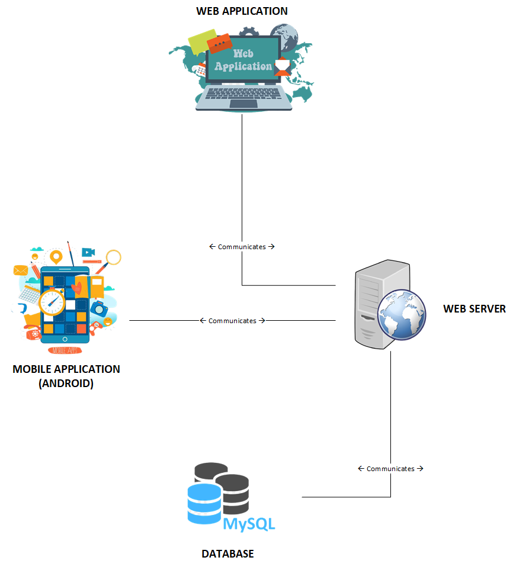
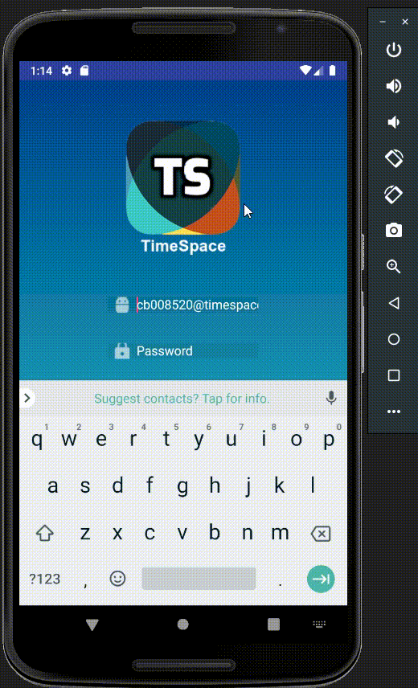
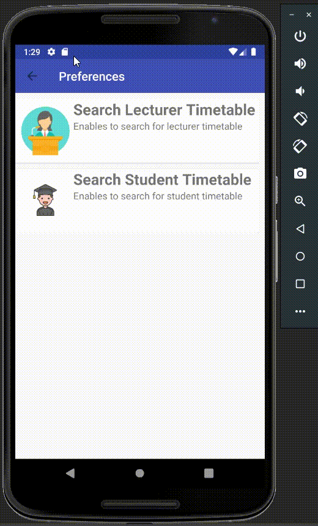
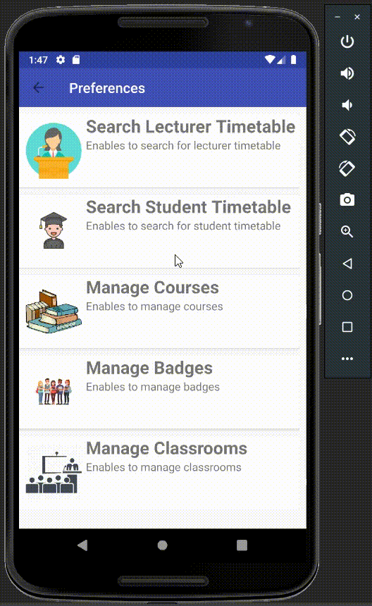
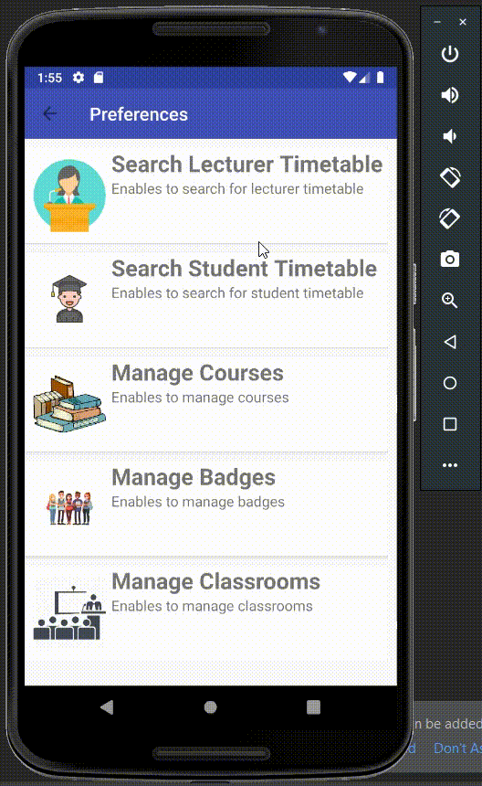

## Project High Level Diagram

<!---->

## 1. Mobile Application Features
**<U>GENERAL FEATURES</U>**

- **Login**

- **Logout**

**<U>STUDENT
</U>**
- **Search Student Timetable**

- **Search Student Timetable**

   
    
**<U>LECTURER
</U>**

- **Search Lecturer Timetable**

- **Search Student Timetable**

- **Book Classroom**

- **Change / Delete Booking**

**<U>ADMINISTRATOR
</U>**

- **Search Lecturer Timetable**

- **Search Student Timetable**

- **Manage Course**

- **Add New Course**

- **Add New Module**

- **Edit / Delete a Course**

- **Edit / Delete a Module**

- **Manage Badges**

    o Add New Badge
    
    o Edit / Delete a Badge
    

- **Manage Classrooms**

    o Add New Classroom
    
    o Edit / Delete a Classroom

## 2. Mobile Application Overview

1. **Login View** 

    

2. **Search Student Timetable**

    

3. **Manage Course (Admin Feature)** 

    * Add New Course
    
        
    
    * Edit / Delete a Course
    
        